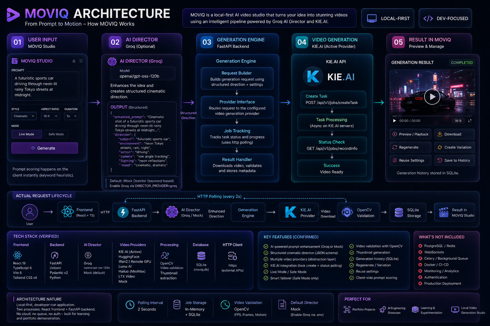

# MOVIQ — From Prompt to Motion

MOVIQ is a local-first AI video generation studio that turns natural-language ideas into structured video-generation workflows. It combines an AI Director for cinematic prompt enhancement, a provider-abstracted generation layer, KIE.AI video generation, HTTP-based job tracking, OpenCV video validation, and a React-based studio interface — designed for engineering experimentation and portfolio demonstration.

<p align="center">
  
  
  
  
  
  
  
</p>

---

## Live AI Video Demo

Real AI video generated through MOVIQ using **KIE.AI / Kling 3.0 Pro** in Live Mode.

<p align="center">
  <a href="https://github.com/rzvn6660/Moviq/releases/download/v3.1.0/moviq-sleek-black-sports-car-driving-through-a-futuristic-city-at.mp4">
    
  </a>
</p>

<p align="center">
  <a href="https://github.com/rzvn6660/Moviq/releases/download/v3.1.0/moviq-sleek-black-sports-car-driving-through-a-futuristic-city-at.mp4">
    
  </a>
  <a href="https://github.com/rzvn6660/Moviq/releases/tag/v3.1.0">
    
  </a>
</p>

> **Live Release Asset:** [`moviq-sleek-black-sports-car-driving-through-a-futuristic-city-at.mp4`](https://github.com/rzvn6660/Moviq/releases/download/v3.1.0/moviq-sleek-black-sports-car-driving-through-a-futuristic-city-at.mp4) attached to Release [`v3.1.0`](https://github.com/rzvn6660/Moviq/releases/tag/v3.1.0).

---

## Quick Links

[Architecture](#architecture) · [How It Works](#how-it-works) · [AI Director](#ai-director) · [Video Providers](#video-providers) · [Features](#features) · [Tech Stack](#tech-stack) · [Quick Start](#quick-start) · [REST API](#rest-api) · [Project Structure](#project-structure)

---

## Architecture

MOVIQ follows a linear pipeline from user input to video result:

```
User Prompt
    ?
MOVIQ Studio  (React 19 + TypeScript)
    ?
AI Director   (Groq API / Mock Director)
    ?
Generation Engine  (FastAPI + GenerationService)
    ?
KIE.AI  (video generation — current active provider)
    ?
Server-side MP4 download
    ?
OpenCV Validation  (fps, frame count, motion diff)
    ?
SQLite  (generation record persistence)
    ?
MOVIQ Studio  (video preview + history)
```



### Pipeline Stages

**1. User Input**
The user provides a text prompt and configures generation parameters: style, aspect ratio, duration, model, and execution mode (Safe or Live).

**2. AI Director**
Transforms the raw prompt into a structured cinematic direction with six fields: subject, environment, action, camera, lighting, and mood. Groq (`openai/gpt-oss-120b`) is the supported LLM backend. If Groq is not configured, MOVIQ falls back to its built-in Mock Director, which uses keyword matching to produce the same output structure without an API call.

**3. Generation Engine**
`GenerationService` (FastAPI, 707 lines) handles request validation against model capabilities, routes the request to the correct provider via a factory pattern, submits the job, and manages status tracking on each poll cycle.

**4. Video Generation**
KIE.AI is the current active video generation provider. The backend submits a task to `api.kie.ai`, receives a task ID, and polls the provider's status endpoint on each frontend request. Additional provider adapters are implemented (see [Video Providers](#video-providers)).

**5. Result Handling**
On completion, the backend downloads the MP4 from the provider's result URL using httpx, validates it with OpenCV, extracts a thumbnail frame, stores the generation record in SQLite, and serves the video locally through a `FileResponse` endpoint.

---

## Application Preview

**Create Studio Workspace** — Prompt composer with style presets, aspect ratio selector, AI Director panel, model picker, and Safe/Live mode toggle.


**Provider Health Dashboard** — Real-time ping status, authentication state, queue indicators, and estimated wait times for all configured providers.


**Generation History** — Searchable, filterable, paginated history grid with thumbnails, favorite stars, status badges, and direct MP4 download.


---

## Safe Mode & Live Mode

MOVIQ enforces explicit execution boundaries to protect API credits during development:

```
                  +-----------------------------------------+
                  ¦           MOVIQ AI VIDEO STUDIO         ¦
                  +-----------------------------------------+
                                       ¦
            +-----------------------------------------------------+
            ?                                                     ?
+-------------------------------+                     +-------------------------------+
¦       SAFE MODE (Default)     ¦                     ¦          LIVE MODE            ¦
+-------------------------------¦                     +-------------------------------¦
¦ Badge: SAFE MODE • LOCAL      ¦                     ¦ Badge: LIVE MODE • KIE.AI     ¦
¦ OpenCV synthetic MP4 output   ¦                     ¦ KIE.AI commercial API         ¦
¦ Zero external API calls       ¦                     ¦ Explicit click + confirmation  ¦
¦ Zero credit consumption       ¦                     ¦ Real generation charges apply  ¦
¦ Full workflow testability      ¦                     ¦ No auto-retries               ¦
+-------------------------------+                     +-------------------------------+
```

- **Safe Mode (default):** Generates a synthetic animated MP4 using OpenCV `VideoWriter`. No external provider is called. Ideal for UI development and testing without consuming paid credits.
- **Live Mode:** Routes generation requests to KIE.AI. Requires an explicit user confirmation before submission. Switching modes is persisted in memory for the session via `PUT /api/v1/settings/execution-mode`.

---

## How It Works

**Example prompt:** *"A futuristic sports car driving through neon-lit rainy Tokyo streets at midnight."*

1. User types the prompt in MOVIQ Studio's Prompt Composer.
2. Client-side prompt scorer evaluates detail across six cinematic dimensions and displays a quality score — no API call.
3. User clicks **Enhance** ? `POST /api/v1/director/enhance` ? AI Director produces a structured cinematic enhancement.
4. Groq API (`openai/gpt-oss-120b`) generates the enhanced prompt and direction, or the Mock Director handles it if Groq is not configured.
5. User clicks **Generate Video** ? `POST /api/v1/generations` (with `Idempotency-Key` header to prevent double-submission).
6. `GenerationService` validates model capabilities, routes to `KieVideoProvider`, which submits `POST https://api.kie.ai/api/v1/jobs/createTask`.
7. KIE.AI returns a `taskId`. The backend stores it in SQLite and an in-memory job dict. Frontend begins polling `GET /api/v1/generations/{id}` every 2 seconds.
8. On each poll, the backend synchronously calls `GET https://api.kie.ai/api/v1/jobs/recordInfo?taskId=...`. On completion, it receives `resultUrl`.
9. Backend downloads the MP4 from `resultUrl` via `httpx.AsyncClient`, saves it to `generated/moviq_{id}.mp4`.
10. OpenCV validates the file: reads frame count, FPS, width/height, and computes a frame-difference motion score to reject static images passed off as video.
11. SQLite is updated: `status = COMPLETED`, `video_url = /api/v1/generations/{id}/video`.
12. Next frontend poll detects `COMPLETED` — the `<video>` element renders. User can preview, download, regenerate, or favorite.

---

## AI Director

The AI Director is a prompt enhancement layer that runs **before** video generation. It does not generate video — it prepares the prompt for the video provider.

When enabled with Groq, the AI Director calls the Groq API with a system prompt instructing it to act as a cinematic director, then requests a structured JSON response containing:

| Field | Description |
|---|---|
| `enhanced_prompt` | Cinematically enriched version of the user's idea |
| `subject` | Main visual subject or object |
| `environment` | Setting, backdrop, and atmosphere |
| `action` | Subject movement or motion dynamics |
| `camera` | Lens, framing, and camera movement |
| `lighting` | Lighting setup and volumetric detail |
| `mood` | Tone and aesthetic feel |

The response format is enforced via Groq's `json_schema` structured output with `strict: true`.

**Groq** ? LLM reasoning / prompt enhancement (text output only)  
**KIE.AI** ? actual video generation (MP4 output)

These are independent systems. Groq produces text. KIE.AI produces video.

If `DIRECTOR_PROVIDER=mock` (the default), a built-in keyword-based Mock Director produces the same response structure without any API call.

---

## Video Providers

MOVIQ uses an abstract `VideoProvider` base class and a factory pattern to route generation requests by `model_id`. This decouples the generation logic from any specific provider.

**Current active provider:** KIE.AI — all live generation requests go through `api.kie.ai`.

The following provider adapters are implemented in the codebase:

| Provider | Model IDs | Category | Status |
|---|---|---|---|
| **KIE.AI** | `kling-3.0/video`, `wan-2.1/video`, `veo-3.1` | Commercial Hosted API | Active (primary) |
| **Hugging Face** | `Wan-AI/Wan2.2-TI2V-5B` | Serverless Inference | Implemented |
| **Remote Wan2.1 GPU** | `Wan-AI/Wan2.1-T2V-1.3B-Diffusers` | Self-Hosted CUDA Worker | Implemented |
| **Luma AI** | `dream-machine` | Commercial Hosted API | Implemented |
| **Hailuo AI** | `hailuo-01` | Commercial Hosted API | Implemented |
| **LTX Video** | `ltx-video` | Local PyTorch GPU | Implemented |
| **Mock (Synthetic)** | `mock-generator` | Local OpenCV | Used in Safe Mode |

> Selecting a model routes the request through the corresponding provider adapter. Switching the active production provider is a configuration change, not an application code change.

---

## Video Validation

MOVIQ uses OpenCV (`cv2`) to inspect every generated video file before marking a generation as complete.

`validate_video_file(filepath)` checks:
- **FPS** — confirms the video has a valid frame rate
- **Frame count** — verifies the file contains actual frames
- **Resolution** — width and height must be non-zero
- **Motion difference** — computes `cv2.absdiff` between two sampled frames and rejects files where the mean frame difference is below threshold (catches still images returned as MP4)
- **SHA-256 hash** — computed for integrity logging

`generate_synthetic_mp4()` is used in Safe Mode — creates an animated gradient MP4 with OpenCV `VideoWriter` and `cv2.putText` overlay, producing a valid video that passes the same validation pipeline without any external API call.

Thumbnail frames are extracted using `cv2.VideoCapture` ? `cap.read()` ? `cv2.imwrite()`.

---

## Storage

MOVIQ uses **SQLite** (`moviq.db`) via SQLAlchemy 2.0. The schema is managed through manual `ALTER TABLE` migrations that run at startup.

**What is stored:**
- All generation records (status, prompts, enhanced prompts, structured direction, provider, model, job ID)
- Generation lifecycle states: `QUEUED ? ENHANCING ? SUBMITTED ? GENERATING ? PROCESSING ? COMPLETED / FAILED / TIMED_OUT`
- Favorites (`is_favorite`, `favorite_at`)
- Prompt fidelity scores and labels
- Execution mode per generation (`safe` or `live`)
- Audit event timelines per generation

Generated MP4 files and thumbnail JPEGs are stored on the local filesystem under `generated/`.

---

## Generation Tracking

MOVIQ tracks long-running generation jobs through **HTTP polling** driven by the frontend.

- After submitting a generation, the frontend polls `GET /api/v1/generations/{id}` every **2 seconds**
- Each poll triggers a synchronous call from the backend to the provider's status API (e.g. KIE.AI's `recordInfo` endpoint)
- On completion, the backend downloads the result, validates it, and updates SQLite — all within the same poll response cycle
- Job state is persisted in SQLite (durable across page refreshes) and tracked in an in-memory dict per provider for the current session
- Generation timeout is enforced at **600 seconds** (`GENERATION_TIMEOUT_SECONDS`)

---

## Features

- **AI Director** — prompt enhancement via Groq LLM or built-in Mock Director
- **Cinematic Prompt Structuring** — subject, environment, action, camera, lighting, mood fields
- **Client-side Prompt Scoring** — six-dimension quality heuristic with real-time feedback
- **Video Generation** — KIE.AI integration (Kling 3.0, Wan 2.1, Veo 3.1)
- **Provider Abstraction** — abstract `VideoProvider` base class with six implemented adapters
- **Safe Mode** — synthetic OpenCV video generation with zero API calls or credit use
- **Live Mode** — real provider generation with explicit user confirmation gate
- **Generation Status Tracking** — 2-second HTTP polling with five-stage progress pipeline
- **Video Preview** — native `<video>` element with progress steps and status indicators
- **OpenCV Validation** — frame-difference motion analysis to detect corrupt or static outputs
- **Download** — H.264 MP4 download with `Content-Disposition: attachment`
- **Regenerate** — re-submit the same prompt and settings
- **Create Variation** — prompt-modified re-generation
- **Reuse Settings** — copy any history item's model, style, aspect ratio, and duration back to the studio
- **Generation History** — searchable, filterable, sortable, paginated history grid
- **Favorites** — star any generation; filter history to favorites
- **Delete** — remove a generation record and its media files
- **Provider Health Dashboard** — real-time status, latency, and authentication checks for all providers
- **Provider Recommender** — rule-based model suggestion based on prompt and parameters
- **Cost Estimator** — estimated generation cost and runtime per model
- **Idempotency** — `Idempotency-Key` header prevents duplicate submissions

---

## Tech Stack

| Layer | Technology |
|---|---|
| Frontend | React 19, TypeScript 6, Vite 8 |
| Styling | Tailwind CSS v4 |
| Icons | Lucide React |
| Frontend HTTP | Native `fetch()` API |
| Backend | Python 3.11+, FastAPI 0.110+, Uvicorn |
| Validation | Pydantic v2 |
| ORM | SQLAlchemy 2.0 |
| Database | SQLite |
| Backend HTTP | httpx (async) |
| AI Director | Groq API (`openai/gpt-oss-120b`) / Mock Director |
| Video Provider | KIE.AI (primary) |
| Video Processing | OpenCV (`cv2`), NumPy |
| ML Inference | Hugging Face `InferenceClient` (optional) |
| GPU Worker | HuggingFace Diffusers + PyTorch (optional, self-hosted) |
| Testing | pytest, pytest-asyncio |

---

## Project Structure

```
Moviq/
+-- src/                          # React 19 + TypeScript frontend
¦   +-- App.tsx                   # Root component — all state and routing
¦   +-- services/apiClient.ts     # MoviqApiClient — all fetch() calls + polling
¦   +-- components/
¦   ¦   +-- workspace/            # PromptComposer, AIDirector, StyleSelector, VideoPreview
¦   ¦   +-- history/              # GenerationHistory, HistoryCard, DeleteConfirmModal
¦   ¦   +-- layout/               # TopNavigation
¦   +-- pages/ProviderHealth.tsx  # Provider health dashboard
¦   +-- types/                    # TypeScript interfaces (api.ts, video.ts)
+-- backend/
¦   +-- app/
¦   ¦   +-- main.py               # FastAPI app, CORS, startup migrations
¦   ¦   +-- api/                  # REST route handlers
¦   ¦   +-- services/
¦   ¦   ¦   +-- generation_service.py   # Core orchestration (707 lines)
¦   ¦   ¦   +-- director/               # groq.py, mock.py, scorer.py, cache.py
¦   ¦   ¦   +-- video/                  # kie.py, huggingface.py, luma.py, hailuo.py, ...
¦   ¦   +-- db/                   # SQLAlchemy session, base, repositories
¦   ¦   +-- models/               # ORM models (Generation, GenerationEvent)
¦   ¦   +-- schemas/              # Pydantic request/response schemas
¦   ¦   +-- utils/video_validator.py    # OpenCV validation + synthetic generation
¦   ¦   +-- core/                 # config.py, logging, exceptions
¦   +-- tests/                    # 18 pytest test files
¦   +-- moviq.db                  # SQLite database (auto-created)
¦   +-- requirements.txt          # Production dependencies
¦   +-- requirements-wan.txt      # Optional: torch, diffusers (GPU worker only)
+-- gpu-worker/
¦   +-- app.py                    # Standalone Wan2.1 CUDA inference worker
+-- demo-assets/                  # Screenshots, architecture diagram, demo MP4
+-- docs/                         # Architecture guide, API reference, developer docs
+-- .env.example                  # Frontend environment template
+-- backend/.env.example          # Backend environment template
+-- package.json
```

---

## Quick Start

### 1. Backend Setup

```bash
cd backend

# Create and activate virtual environment
python -m venv venv
source venv/bin/activate      # Windows: venv\Scripts\activate

# Install dependencies
pip install -r requirements.txt

# Copy environment template
cp .env.example .env
# Edit .env — configure KIE_API_KEY and optionally GROQ_API_KEY

# Start FastAPI backend (port 8001)
set PYTHONPATH=.              # Windows
# export PYTHONPATH=.         # Linux/macOS
python -m uvicorn app.main:app --host 127.0.0.1 --port 8001
```

### 2. Frontend Setup

```bash
# In repository root
npm install
npm run dev
```

Open `http://localhost:5173` in your browser.

### 3. Environment Variables

Key variables in `backend/.env`:

| Variable | Required | Description |
|---|---|---|
| `KIE_API_KEY` | Yes (Live Mode) | KIE.AI API key for video generation |
| `KIE_MODEL` | No | Default model (`kling-3.0/video`) |
| `DIRECTOR_PROVIDER` | No | `mock` (default) or `groq` |
| `GROQ_API_KEY` | Only if `groq` | Groq API key for AI Director |
| `GROQ_MODEL` | No | Groq model (`openai/gpt-oss-120b`) |
| `MOVIQ_EXECUTION_MODE` | No | `safe` (default) or `live` |
| `GENERATION_TIMEOUT_SECONDS` | No | Max wait per generation (`600`) |
| `ENABLE_SYNTHETIC_FALLBACK` | No | Fall back to synthetic on provider error (`false`) |
| `VITE_API_BASE_URL` | No | Frontend ? Backend URL (`http://localhost:8001/api/v1`) |

**Minimum for Safe Mode** (local testing, no API keys needed):
```env
MOVIQ_EXECUTION_MODE=safe
DIRECTOR_PROVIDER=mock
```

**Minimum for Live Mode:**
```env
MOVIQ_EXECUTION_MODE=live
VIDEO_PROVIDER=kie
KIE_API_KEY=your_kie_api_key
DIRECTOR_PROVIDER=groq        # optional
GROQ_API_KEY=your_groq_key    # optional
```

---

## REST API

| Method | Endpoint | Description |
|---|---|---|
| `GET` | `/api/v1/health` | Health check |
| `POST` | `/api/v1/director/enhance` | Enhance prompt via AI Director |
| `GET` | `/api/v1/models` | List model capabilities |
| `POST` | `/api/v1/generations` | Submit generation request |
| `GET` | `/api/v1/generations` | List generation history (search, filter, sort, paginate) |
| `GET` | `/api/v1/generations/{id}` | Poll generation status and result |
| `DELETE` | `/api/v1/generations/{id}` | Delete generation and associated files |
| `PATCH` | `/api/v1/generations/{id}/favorite` | Toggle favorite |
| `GET` | `/api/v1/generations/{id}/video` | Stream MP4 (with `Accept-Ranges`) |
| `GET` | `/api/v1/generations/{id}/thumbnail` | Get thumbnail JPEG |
| `GET` | `/api/v1/generations/{id}/download` | Download MP4 with `Content-Disposition: attachment` |
| `POST` | `/api/v1/generations/{id}/retry` | Retry a failed generation |
| `POST` | `/api/v1/generations/{id}/variations` | Create a prompt variation |
| `GET` | `/api/v1/generations/{id}/events` | Audit event timeline |
| `GET` | `/api/v1/providers/health` | Provider status and latency |
| `POST` | `/api/v1/providers/recommend` | Rule-based provider recommendation |
| `POST` | `/api/v1/providers/estimate-cost` | Generation cost estimate |
| `GET` | `/api/v1/providers/benchmarks` | Provider performance benchmarks |
| `GET` | `/api/v1/settings/execution-mode` | Get current mode (safe/live) |
| `PUT` | `/api/v1/settings/execution-mode` | Set execution mode |

FastAPI automatic docs available at `http://localhost:8001/docs`.

---

## Documentation

- [Architecture Guide](docs/ARCHITECTURE.md)
- [Provider Matrix Reference](docs/PROVIDER_MATRIX.md)
- [REST API Documentation](docs/API_DOCUMENTATION.md)
- [Developer Quickstart Guide](docs/DEVELOPER_QUICKSTART.md)
- [Troubleshooting Guide](docs/TROUBLESHOOTING.md)
- [FAQ](docs/FAQ.md)

---

## Current Status

MOVIQ is a **local-first, developer-focused** AI video generation studio built for engineering exploration, portfolio demonstration, and provider integration development.

The current implementation is not intended for production deployment. There is no authentication layer, no container configuration, and no cloud infrastructure. The database is SQLite and video files are stored on the local filesystem.

### Roadmap

- [ ] Persistent job queue for backend-restart resilience
- [ ] User authentication and multi-user support
- [ ] Docker Compose setup for local deployment
- [ ] Cloud object storage for generated videos
- [ ] Provider failover in Live Mode
- [ ] Multi-shot generation and keyframe workflows
- [ ] CI/CD pipeline
- [ ] Production deployment guide

---

## License

Distributed under the **MIT License**. See [`LICENSE`](LICENSE) for details.
