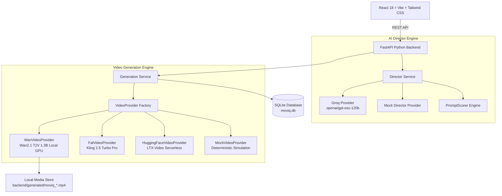

# Moviq — Turn Ideas Into Motion

> AI-Powered Video Creation Studio transforming simple user ideas into professionally directed motion clips.

---

## 📌 Overview

**Moviq** is a full-stack AI video creation studio designed to turn simple text prompts into high-fidelity AI videos. It pairs a **Groq-powered AI Director (`openai/gpt-oss-120b`)** for cinematic parameter expansion with a **multi-provider Video Generation Engine** supporting local GPU execution (**Wan2.1 T2V 1.3B**), cloud queues (**fal-ai Kling 2.5 Turbo Pro**), serverless inference (**Hugging Face Inference Providers**), and deterministic offline simulation (**MockProvider**).

---

## 🎬 Demo Workflow

```
Idea Input ──► AI Director ──► Enhanced Prompt & 6-Axis Parameters ──► Model & Settings ──► Video Engine ──► Playback & Export
```

1. **Idea Input**: User enters a simple concept (e.g. *"A futuristic sports car driving through a rain-soaked city at night"*).
2. **AI Director Enhancement**: Groq expands the idea into an enhanced prompt and 6-axis camera direction parameters (`subject`, `environment`, `action`, `camera`, `lighting`, `mood`), providing a before/after prompt score.
3. **Interactive Control**: User retains full control to inspect, edit, or customize the enhanced prompt and negative parameters.
4. **Generation & Lifecycle**: Generation request is submitted with a unique `Idempotency-Key` header, advancing through async lifecycle stages (`QUEUED` → `SUBMITTED` → `GENERATING` → `PROCESSING` → `COMPLETED`).
5. **Playback & Export**: Rendered video streams in the custom VideoPreview player with one-click download, variation creation, and persistent history.

---

## ⭐ Core Features

- **Groq AI Director (`openai/gpt-oss-120b`)**: Structured output generation for camera framing, lighting ratio, and cinematic mood mapping.
- **Deterministic PromptScorer**: 100-point scoring engine quantifying prompt enhancement quality.
- **Wan2.1 T2V 1.3B Open-Source Provider**: Locally executable PyTorch & Diffusers GPU diffusion pipeline.
- **Multi-Provider Abstraction**: Decoupled `VideoProvider` architecture supporting Mock, fal-ai, Hugging Face, and Wan2.1.
- **Backend-Enforced Idempotency**: Database-level deduplication via `Idempotency-Key` headers.
- **Truthful Asynchronous Progress**: Supports both percentage-based and stage-based progress indicators.
- **Generation Inspector**: Detailed technical metadata viewer exposing render resolution, FPS, engine parameters, and prompt lineage.
- **Security & SSRF Hardening**: Bounded streaming proxy downloads with strict URL validation and path traversal protection.

---

## 📐 System Architecture



---

## 🤖 AI Director Engine

The AI Director transforms raw user prompts into structured 6-axis camera direction:
- **Subject**: Focal element and character framing
- **Environment**: Location, background elements, and weather conditions
- **Action**: Subject velocity, motion vector, and interaction
- **Camera**: Lens choice, focal length (e.g. 35mm / 85mm), tracking trajectory, and dolly movement
- **Lighting**: Volumetric key light, rim lighting, and contrast ratio
- **Mood**: Color palette and emotional atmosphere

The deterministic `PromptScorer` evaluates readability, detail density, lighting specifications, and cinematic keywords, assigning a before-and-after quality score (0–100).

---

## ⚡ Video Generation Engine & Wan2.1 Validation

Moviq supports local open-source text-to-video rendering via `WanVideoProvider`.

### Verified Wan2.1 Standalone Hardware Validation
- **Model**: `Wan-AI/Wan2.1-T2V-1.3B-Diffusers`
- **GPU Hardware**: Tesla P100-PCIE-16GB (CUDA compute capability 6.0)
- **Frameworks**: PyTorch `2.7.1+cu118`, Diffusers `0.35.2`, Transformers `4.57.1`
- **Render Resolution**: `576 × 320`
- **Frames**: `33`
- **FPS**: `16`
- **Inference Steps**: `20`
- **Guidance Scale**: `5.0`
- **Precision**: `float16` with CPU offloading (`enable_model_cpu_offload()`) and VAE tiling (`enable_vae_tiling()`)
- **Render Output**: $\approx 2.06$ seconds output clip

*Note: Kaggle was used as a free GPU compute environment for standalone model validation. Kaggle is NOT a production Moviq API endpoint. Production deployments execute `WanVideoProvider` on dedicated GPU workers.*

---

## 🔌 API Reference Summary

| Endpoint | Method | Description |
| :--- | :--- | :--- |
| `/api/v1/health` | `GET` | Service health status and version info |
| `/api/v1/models` | `GET` | List available video model capabilities |
| `/api/v1/director/enhance` | `POST` | Expand prompt into structured 6-axis direction |
| `/api/v1/generations` | `POST` | Submit video generation job (supports `Idempotency-Key`) |
| `/api/v1/generations/{id}` | `GET` | Poll generation status, progress, or output |
| `/api/v1/generations/{id}/video` | `GET` | Serve locally stored MP4 video file |
| `/api/v1/generations/{id}/download` | `GET` | Secure streaming proxy download with `Content-Disposition` |
| `/api/v1/generations` | `GET` | List recent generation history |

---

## 🛠️ Setup & Installation

### 1. Prerequisites
- Python 3.10+
- Node.js 18+

### 2. Backend Setup
```bash
cd backend
python -m venv venv
venv\Scripts\activate

# Standard lightweight dependencies
pip install -r requirements.txt

# (Optional) Wan2.1 Local GPU Inference dependencies
pip install -r requirements-wan.txt
```

### 3. Environment Configuration
Copy `.env.example` to `.env` in `backend/`:
```bash
cp .env.example .env
```
Configure environment settings in `backend/.env`:
```env
VIDEO_PROVIDER=mock       # "mock", "fal", "huggingface", or "wan"
DIRECTOR_PROVIDER=mock   # "mock" or "groq"
GROQ_API_KEY=your_groq_key_here
```

### 4. Frontend Setup
```bash
# In project root
npm install
npm run dev
```

---

## 🧪 Testing & Quality Assurance

Run the comprehensive backend test suite:
```bash
cd backend
venv\Scripts\python -m pytest
```
**Test Results**: `53 passed out of 53 tests` (100% pass rate in 11.18s).

Run frontend production build verification:
```bash
npm run build
```
**Build Result**: `Succeeded in 2.25s` with 0 TypeScript or Vite errors.

---

## 🛠️ Key Engineering Decisions

1. **Provider Abstraction**: `VideoProvider` abstract base class isolates model provider specifics from business logic.
2. **Backend-Enforced Idempotency**: Unique `Idempotency-Key` header tracking backed by database unique indexes prevents duplicate job execution.
3. **Truthful Progress**: Indeterminate stage-based progress indicators avoid fabricating fake percentages.
4. **Lazy ML Dependencies**: PyTorch and Diffusers packages load dynamically on demand when `WanVideoProvider` runs inference.
5. **Memory Safety**: `float16` precision, CPU offloading, and VAE tiling allow 1.3B Wan diffusion models to run on 16GB GPUs without custom CUDA extension compilation (`flash-attn`).
6. **Streaming Proxy Security**: Video downloads stream asynchronously in 64KB chunks with strict SSRF host verification.

---

## ⚠️ Limitations & Transparency

- **GPU Requirement for Wan2.1**: Running local diffusion inference via `WanVideoProvider` requires a CUDA-capable GPU and optional dependencies (`requirements-wan.txt`).
- **Render Latency**: Local diffusion generation on 16GB GPUs takes ~3 minutes for 33 frames (2.06s clip).
- **Remote Providers**: Third-party providers (fal-ai / Hugging Face) depend on active API account balances and external serverless availability.
