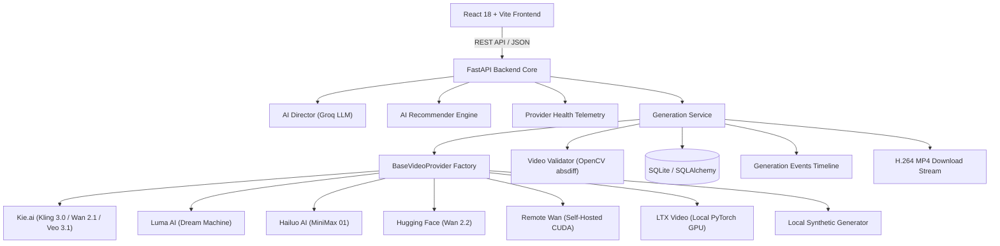

# 🎬 Moviq

> **Provider-Independent AI Video Generation & Orchestration Platform** built with **React 18**, **FastAPI**, **TypeScript**, **Python**, **OpenCV**, and **PyTorch**.

Moviq is an open-source AI video generation platform that unifies commercial AI video services and self-hosted diffusion models behind a single, provider-independent architecture. It combines AI-powered prompt direction, intelligent provider routing, computer vision validation, and execution observability into one modern developer experience.

<p align="center">
  
  
  
  
  
  
  
  
</p>

---

# 🎬 Live AI Video Demo

<p align="center">
  
</p>

Real AI video generated through Moviq using **Kie.ai / Kling 3.0 Pro**, distinguished from local synthetic Safe Mode output.

<p align="center">
  <a href="https://github.com/rzvn6660/Moviq/releases/download/v3.1.0/moviq-sleek-black-sports-car-driving-through-a-futuristic-city-at.mp4">
    
  </a>
</p>

<p align="center">
  <a href="https://github.com/rzvn6660/Moviq/releases/download/v3.1.0/moviq-sleek-black-sports-car-driving-through-a-futuristic-city-at.mp4">
    
  </a>
  <a href="https://github.com/rzvn6660/Moviq/releases/tag/v3.1.0">
    
  </a>
</p>

```text
Prompt → AI Director → Provider Routing → Kie.ai / Kling 3.0 → OpenCV Validation → History
```

> **Note**
> 
> * **Live Release Asset**: [`moviq-sleek-black-sports-car-driving-through-a-futuristic-city-at.mp4`](https://github.com/rzvn6660/Moviq/releases/download/v3.1.0/moviq-sleek-black-sports-car-driving-through-a-futuristic-city-at.mp4) attached to Release [`v3.1.0`](https://github.com/rzvn6660/Moviq/releases/tag/v3.1.0).
> * **Repository Artifact**: [`demo-assets/moviq-sleek-black-sports-car-driving-through-a-futuristic-city-at.mp4`](demo-assets/moviq-sleek-black-sports-car-driving-through-a-futuristic-city-at.mp4).

---

# 🚀 Quick Links

[Overview](#-overview) • [Why Moviq](#-why-moviq) • [Execution Safety Modes](#-safe-development--live-demo-modes) • [Architecture](#-architecture) • [Supported Providers](#-supported-providers) • [Application Preview](#-application-preview) • [Quick Start](#-quick-start) • [REST API](#-rest-api) • [Documentation](#-documentation)

---

# 📌 Overview

Moviq solves AI video engine fragmentation by establishing a single abstraction layer over diverse generation backends. Whether submitting tasks to cloud commercial endpoints (Kie.ai Kling, Luma AI, Hailuo AI), serverless inference (Hugging Face), or self-hosted GPU clusters (Remote Wan CUDA, local LTX Video), Moviq standardizes prompt deconstruction, execution polling, computer-vision output verification, and client delivery.

The platform provides an AI Director for keyframe prompt refinement, telemetry monitoring, cost estimation, microsecond event logging, and OpenCV-based perceptual motion validation to reject static images disguised as videos.

---

# 💡 Why Moviq?

Integrating multiple AI video providers introduces significant engineering challenges:
- **Schema & Polling Fragmentation**: Upstream APIs differ drastically in request payloads, status polling keys, completion states, and error codes.
- **Silent Output Corruption**: Cloud APIs occasionally return broken headers or still images disguised as MP4 video streams.
- **Credit Loss Risk**: Uncontrolled automatic retries, accidental page refreshes, or automated test runs can rapidly consume paid API credits.

Moviq resolves these challenges through a **Unified Provider Factory Pattern**, **OpenCV Frame-Difference Motion Validation**, and **Dual Safe/Live Execution Modes**.

---

# 🛡️ Safe Development & Live Demo Modes

Moviq enforces explicit execution boundaries to protect API credits while maintaining rapid local development velocity:

```
                  ┌─────────────────────────────────────────┐
                  │          MOVIQ AI VIDEO STUDIO          │
                  └────────────────────┬────────────────────┘
                                       │
            ┌──────────────────────────┴──────────────────────────┐
            ▼                                                     ▼
┌───────────────────────────────┐                     ┌───────────────────────────────┐
│     DEVELOPMENT / SAFE MODE   │                     │        LIVE DEMO MODE         │
├───────────────────────────────┤                     ├───────────────────────────────┤
│ • UI Badge:                   │                     │ • UI Badge:                   │
│   SAFE MODE • LOCAL SYNTHETIC │                     │   LIVE MODE • KIE.AI          │
│ • Local synthetic MP4 engine  │                     │ • Commercial Kie.ai backend   │
│ • $0.00 Credit consumption    │                     │ • Explicit user click ONLY    │
│ • Full workflow testing       │                     │ • Authorization modals        │
│ • Pytest suite isolation      │                     │ • No auto-retries or failover │
└───────────────────────────────┘                     └───────────────────────────────┘
```

* **`SAFE MODE • LOCAL SYNTHETIC` (Default)**: Generates validated local synthetic MP4 previews using OpenCV `VideoWriter`. Zero external API calls are made and zero credits are consumed. Default mode for automated tests and frontend development.
* **`LIVE MODE • KIE.AI`**: Directs requests to commercial Kie.ai endpoints. Paid generation requires an explicit button click and user confirmation modal (`Live generation uses Kie.ai credits.`). Paid retries and smart failovers are never executed automatically.

---

# 🏗️ Architecture



### Execution Lifecycle:
`Prompt` → `AI Director` → `Provider Recommendation` → `Provider Factory` → `Video Generation` → `Telemetry Polling` → `OpenCV Validation` → `History & Download`

---

# 📊 Supported Providers

| Provider | Model ID | Execution Category | Supported Aspect Ratios | Max Duration | Negative Prompt |
| :--- | :--- | :--- | :--- | :--- | :--- |
| **Kie.ai** | `kling-3.0/video` | Commercial Hosted API | `16:9`, `9:16`, `1:1` | 10s | Yes |
| **Kie.ai** | `wan-2.1/video` | Commercial Hosted API | `16:9`, `1:1` | 5s | Yes |
| **Kie.ai** | `veo-3.1` | Commercial Hosted API | `16:9`, `9:16`, `1:1` | 10s | No |
| **Luma AI** | `dream-machine` | Commercial Hosted API | `16:9`, `9:16`, `1:1` | 5s | No |
| **Hailuo AI** | `hailuo-01` | Commercial Hosted API | `16:9`, `9:16`, `1:1` | 5s | Yes |
| **Hugging Face** | `Wan-AI/Wan2.2-TI2V-5B` | Serverless Inference | `16:9` | 5s | Yes |
| **Remote Wan** | `Wan-AI/Wan2.1-T2V-1.3B-Diffusers` | Self-Hosted CUDA | `16:9` | 5s | Yes |
| **LTX Video** | `ltx-video` | Local PyTorch GPU | `16:9` | 5s | Yes |
| **Synthetic Mock** | `mock-generator` | Local Synthetic | `16:9`, `9:16`, `1:1` | 10s | Yes |

---

# 🖼️ Application Preview

#### 1. Create Studio Workspace
Prompt composer featuring style presets, aspect ratio selectors, AI Director drawer, model recommendation, and execution mode toggle.


#### 2. Provider Operations Telemetry Dashboard
Real-time ping gauges, queue status, authentication verification, and performance metrics for all provider nodes.


#### 3. Recent Generation History
Media grid with auto-generated thumbnails, prompt search filters, status filters, star favorites, execution mode tags, and direct MP4 downloads.


---

# ⚙️ Tech Stack

* **Frontend**: React 18, TypeScript, Vite, Tailwind CSS, Lucide Icons.
* **Backend**: Python 3.11+, FastAPI, SQLAlchemy, Pydantic v2, Uvicorn.
* **AI & Machine Learning**: Groq LLM (AI Director Prompt Enhancement), PyTorch, Hugging Face Diffusers.
* **Computer Vision**: OpenCV (`cv2`) for frame-difference motion analysis and synthetic rendering.
* **Testing & Quality Assurance**: Pytest, Pytest-Asyncio (87/87 tests passed).

---

# ⚡ Quick Start

### 1. Backend Setup
```bash
cd backend

# Create & activate virtual environment
python -m venv venv
source venv/bin/activate  # On Windows: venv\Scripts\activate

# Install dependencies & copy environment template
pip install -r requirements.txt
cp .env.example .env

# Run FastAPI backend server (port 8001)
$env:PYTHONPATH="."
python -m uvicorn app.main:app --host 127.0.0.1 --port 8001
```

### 2. Frontend Setup
```bash
# In repository root
npm install
npm run dev
```
Open **`http://localhost:5173`** in your browser.

---

# 🎬 Demo Flow

1. **Compose Prompt**: Enter your visual idea in the prompt composer.
2. **Enhance with AI Director**: Expand raw text into keyframe cinematography (camera movement, lighting, mood).
3. **Select/Recommend Engine**: Pick a model manually or allow Moviq's semantic recommender to suggest the optimal engine.
4. **Choose Execution Mode**: Select `SAFE MODE` (synthetic test) or `LIVE MODE` (commercial API).
5. **Generate Video**: Click **Generate Video** (with confirmation dialog in Live Mode).
6. **Track Lifecycle**: Observe real-time queueing, generation, and status telemetry.
7. **OpenCV Motion Validation**: Moviq automatically verifies frame variance via `cv2.absdiff`.
8. **Preview & Export**: View video output, inspect execution metadata, download H.264 MP4, and save to history.

---

# 🔬 Technical Highlights

- **Abstract Factory Pattern**: Enforces unified `BaseVideoProvider` lifecycle contract across 9 generation targets.
- **AI-Assisted Cinematography**: Deconstructs raw prompts into keyframed visual parameters via LLM integration.
- **Deterministic Recommender**: Evaluates semantic intent to match prompts with optimal video backends.
- **OpenCV Motion Validation**: Computes frame-difference variance to automatically catch and reject corrupt or static image outputs.
- **Credit-Protected Execution Guard**: Prevents unexpected credit consumption via default Safe Mode and explicit authorization modals.
- **100% Test Suite Coverage**: 87 comprehensive Pytest tests covering provider factory routing, safety guards, validation logic, and REST endpoints.

---

# 📡 REST API Summary

| Method | Endpoint | Description |
| :--- | :--- | :--- |
| `GET` | `/api/v1/settings/execution-mode` | Get current execution mode (`safe` or `live`). |
| `PUT` | `/api/v1/settings/execution-mode` | Dynamically set execution mode. |
| `GET` | `/api/v1/providers/health` | Live telemetry for provider nodes. |
| `POST` | `/api/v1/providers/recommend` | Rule-based prompt recommendation evaluator. |
| `POST` | `/api/v1/generations` | Submits generation task. |
| `GET` | `/api/v1/generations/{id}` | Status, progress, and result payload. |
| `GET` | `/api/v1/generations/{id}/events` | Audit event timeline tracking. |
| `GET` | `/api/v1/generations/{id}/download` | Streams verified H.264 MP4 file with `Content-Disposition`. |

---

# 📚 Documentation Index

- 🏛️ [Architecture Guide](docs/ARCHITECTURE.md)
- 📊 [Provider Matrix Reference](docs/PROVIDER_MATRIX.md)
- 📡 [REST API Documentation](docs/API_DOCUMENTATION.md)
- 🚀 [Developer Quickstart Guide](docs/DEVELOPER_QUICKSTART.md)
- 🛠️ [Troubleshooting Guide](docs/TROUBLESHOOTING.md)
- ❓ [Frequently Asked Questions (FAQ)](docs/FAQ.md)
- 💡 [Technical Interview Q&A Guide](docs/INTERVIEW_GUIDE.md)

---

# 📄 License & Author

Distributed under the **MIT License**. See [`LICENSE`](LICENSE) for details.

Maintained by **Open Source Contributors** • Built with Python & React.
