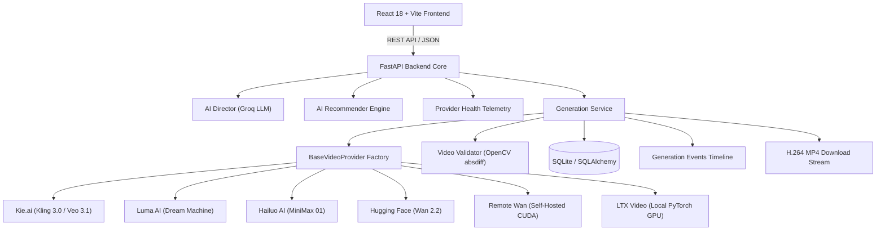

# 🎬 Moviq

<p align="center">
  <strong>Production-Ready AI Video Generation Studio with Multi-Provider Orchestration</strong>
</p>

<p align="center">
  <a href="https://react.dev"></a>
  <a href="https://fastapi.tiangolo.com"></a>
  <a href="https://www.typescriptlang.org"></a>
  <a href="https://www.python.org"></a>
  <a href="https://opencv.org"></a>
  <a href="https://pytorch.org"></a>
  <a href="https://pytest.org"></a>
  <a href="LICENSE"></a>
</p>

---

## 🎥 Live Demo Showcase

<p align="center">
  
</p>

<p align="center">
  <a href="https://github.com/rzvn6660/Moviq/releases/tag/v3.1.0"></a>
  &nbsp;&nbsp;
  <a href="docs/DEVELOPER_QUICKSTART.md"></a>
</p>

---

## 📌 Overview

**Moviq** is an open-source AI video generation studio designed around a provider-independent backend architecture. It unifies commercial cloud AI engines (Kie Kling 3.0, Veo 3.1, Luma Dream Machine, MiniMax Hailuo) and open-source diffusion models (Hugging Face Wan 2.2, Remote Wan, LTX Video) behind a single FastAPI service layer.

Instead of managing fragmented APIs and silent polling failures, Moviq provides live provider health telemetry, a rule-based AI prompt recommendation engine, optional transparent smart failover, a 13-stage microsecond event timeline, and defensive computer vision motion validation using OpenCV.

---

## ✨ Key Features

### 🤖 AI Features
- **AI Director Prompt Enhancer**: Structural prompt decomposition (Subject, Environment, Action, Camera, Lighting, Mood) powered by Groq LLM with offline mock fallback.
- **Semantic Recommender Engine**: Rule-based prompt semantics evaluator matching visual themes to optimal models (cars → Kling, nature → Luma, anime → Hailuo).
- **Smart Failover**: Transparent fallback execution sequence with microsecond audit event logging.

### ⚙️ Engineering & Observability
- **Multi-Provider Factory**: Unified `BaseVideoProvider` interface handling authentication, submission, async status polling, and payload delivery.
- **Provider Health Telemetry**: Live ping latency, queue traffic, and credential status with an async 45-second TTL cache lock.
- **Microsecond Timeline Inspector**: 13-stage audit trail tracking every lifecycle step from prompt reception to thumbnail extraction.

### 🎥 Video Pipeline & Validation
- **Computer Vision Frame Analysis**: OpenCV `absdiff` perceptual frame-difference calculation that automatically detects and rejects static images disguised as MP4s.
- **H.264 MP4 Delivery**: Standards-compliant MP4 file streaming with `Content-Disposition` headers and path traversal shielding.

### 🛠️ Developer Experience
- **Synthetic Local Fallback**: Generates dynamic MP4 previews locally using OpenCV `VideoWriter` for offline testing without paid API keys.
- **Automated Test Suite**: 87 Pytest unit, integration, and stress tests achieving 100% pass rate.

---

## 🏗️ System Architecture



---

## 📊 Provider Capability Matrix

| Provider | Model ID | Execution Mode | Supported Aspect Ratios | Max Duration | Negative Prompt |
| :--- | :--- | :--- | :--- | :--- | :--- |
| **Kie.ai** | `kling-3.0/video` | Hosted API | `16:9`, `9:16`, `1:1` | 10s | Yes |
| **Kie.ai** | `wan-2.1/video` | Hosted API | `16:9`, `1:1` | 5s | Yes |
| **Kie.ai** | `veo-3.1` | Hosted API | `16:9`, `9:16`, `1:1` | 10s | No |
| **Luma AI** | `dream-machine` | Hosted API | `16:9`, `9:16`, `1:1` | 5s | No |
| **Hailuo AI** | `hailuo-01` | Hosted API | `16:9`, `9:16`, `1:1` | 5s | Yes |
| **Hugging Face** | `Wan-AI/Wan2.2-TI2V-5B` | Serverless Inference | `16:9` | 5s | Yes |
| **Remote Wan** | `Wan-AI/Wan2.1-T2V-1.3B-Diffusers` | Self-Hosted CUDA | `16:9` | 5s | Yes |
| **LTX Video** | `ltx-video` | Local PyTorch GPU | `16:9` | 5s | Yes |

---

## 🖼️ Screenshot Gallery

#### 1. Create Studio Workspace
Prompt composer with style presets, aspect ratio selectors, AI Director drawer, and model recommendations.


#### 2. Provider Operations Telemetry Dashboard
Real-time latency ping gauges, authentication status, queue status, and benchmark metrics for all 6 provider nodes.


#### 3. Recent Generation History & Favorites
Auto-generated thumbnails, prompt search filters, status filters, star favorites, and direct MP4 downloads.


---

## ⚡ 2-Minute Quick Start

### 1. Backend Setup
```bash
cd backend

# Create & activate virtual environment
python -m venv venv
source venv/bin/activate  # On Windows: venv\Scripts\activate

# Install dependencies & set environment variables
pip install -r requirements.txt
cp .env.example .env

# Run FastAPI dev server (port 8001)
uvicorn app.main:app --port 8001 --reload
```

### 2. Frontend Setup
```bash
# In repository root
npm install
npm run dev
```
Open **`http://localhost:5173`** in your browser.

---

## 📡 API Overview

- `GET /api/v1/providers/health`: Returns live telemetry for all 6 provider nodes (45s TTL cache).
- `POST /api/v1/providers/recommend`: Rule-based semantic prompt recommendation.
- `POST /api/v1/generations`: Submits video generation task (supports `Idempotency-Key` header).
- `GET /api/v1/generations/{id}`: Returns progress, status, and download links.
- `GET /api/v1/generations/{id}/events`: Returns 13-stage microsecond audit events timeline.
- `GET /api/v1/generations/{id}/download`: Streams verified H.264 MP4 file with `Content-Disposition`.

---

## 📂 Project Structure

```text
Moviq/
├── backend/
│   ├── app/
│   │   ├── api/             # FastAPI REST router endpoints
│   │   ├── core/            # Config settings & exception taxonomy
│   │   ├── db/              # SQLAlchemy models & repositories
│   │   ├── schemas/         # Pydantic v2 validation schemas
│   │   ├── services/        # Provider factory, health & recommender
│   │   └── utils/           # OpenCV motion validator & synthetic fallback
│   └── tests/               # 87 Pytest unit, integration & stress tests
├── src/                     # React 18 TypeScript frontend
│   ├── components/          # Studio, history, timeline & health components
│   ├── pages/               # Provider Operations dashboard
│   └── services/            # API client fetch wrappers
├── docs/                    # Deep-dive architecture & API guides
└── .github/                 # Issue & PR open-source templates
```

---

## 📚 Documentation Index

- 🏛️ [Architecture Guide](docs/ARCHITECTURE.md)
- 📊 [Provider Matrix Reference](docs/PROVIDER_MATRIX.md)
- 📡 [REST API Documentation](docs/API_DOCUMENTATION.md)
- 🚀 [Developer Quickstart Guide](docs/DEVELOPER_QUICKSTART.md)
- 🛠️ [Troubleshooting Guide](docs/TROUBLESHOOTING.md)
- ❓ [Frequently Asked Questions (FAQ)](docs/FAQ.md)
- 💡 [Technical Interview Q&A Guide](docs/INTERVIEW_GUIDE.md)

---

## ⚠️ Limitations & Roadmap

### Limitations
- **Health Cache**: Uses an in-memory 45-second TTL cache (suited for single instances; Redis recommended for multi-worker clusters).
- **Database**: SQLite default for local development (PostgreSQL recommended for production).

### Roadmap
- [ ] Redis shared cache adapter for multi-worker backend deployment.
- [ ] Alembic database migration scripts.
- [ ] WebSockets push subscription for real-time progress timeline events.

---

## 📄 License & Author

Distributed under the **MIT License**. See [`LICENSE`](LICENSE) for details.

Maintained by **Open Source Contributors** • Built with Python & React.
