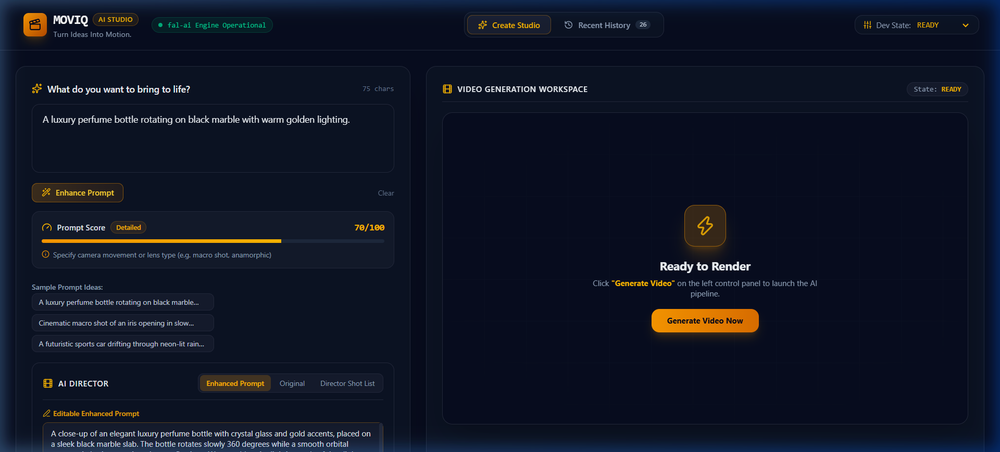
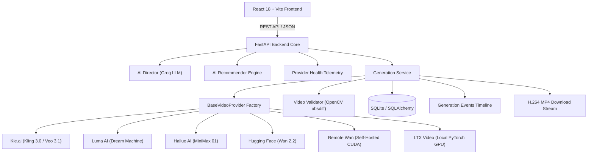
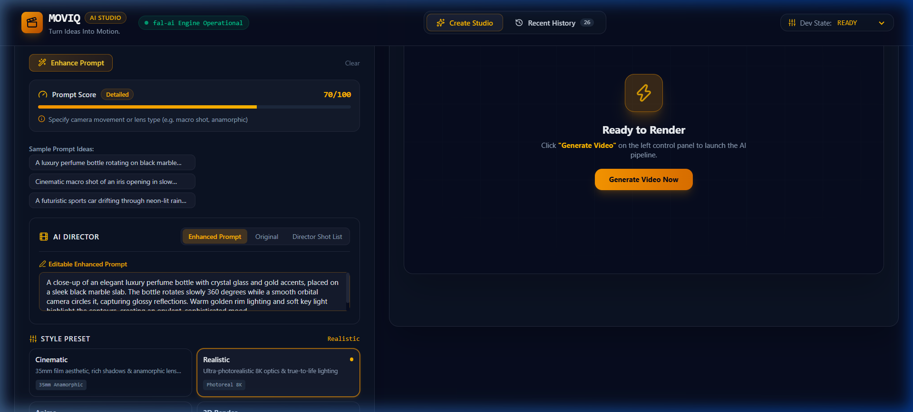
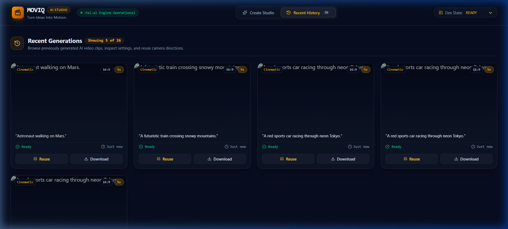

# 🎬 Moviq

> **Production-ready AI Video Generation Platform** built with **React**, **FastAPI**, **TypeScript**, **Python**, and **OpenCV**.

Moviq is an open-source AI video generation platform that unifies multiple commercial and open-source video generation providers behind a single, provider-independent architecture. It combines AI-powered prompt enhancement, intelligent provider routing, computer vision validation, and execution observability into one modern developer experience.

<p align="center">
  
  
  
  
  
  
  
  
</p>

---

# 🎥 Live Demo

<p align="center">
  <a href="https://github.com/rzvn6660/Moviq/releases/tag/v3.1.0">
    
  </a>
</p>

<p align="center">
  <a href="https://github.com/rzvn6660/Moviq/releases/tag/v3.1.0">
    
  </a>
  <a href="./docs/DEVELOPER_QUICKSTART.md">
    
  </a>
  <a href="./docs/API_DOCUMENTATION.md">
    
  </a>
</p>

> **Note**
>
> The full demonstration video is available in the GitHub Release assets. The preview above is a short GIF showing the application workflow.

---

# 🚀 Quick Links

[Overview](#-overview) • [Why Moviq](#-why-moviq) • [Architecture](#-architecture) • [Features](#-key-features) • [Provider Matrix](#-supported-providers) • [Application Preview](#-application-preview) • [Quick Start](#-quick-start) • [REST API](#-rest-api) • [Documentation](#-documentation)

---

# 📌 Overview

Moviq is an open-source AI video generation platform built around a provider-independent architecture. It unifies commercial AI video services and self-hosted diffusion models behind a single FastAPI backend, enabling consistent prompt enhancement, generation workflows, validation, and media delivery.

The platform includes an AI Director for prompt refinement, provider health telemetry, deterministic provider recommendation, transparent failover, execution timeline observability, and OpenCV-based motion validation to verify generated video outputs before delivery.

> **Note**
>
> Some providers require their own API keys, active subscriptions, or usage credits. Availability, generation time, and output quality depend on the selected provider.

---

# 💡 Why Moviq?

Integrating multiple AI video models typically introduces significant engineering complexity:
- **API Fragmentation**: Upstream providers vary wildly in request schemas, polling intervals, error taxonomy, and credit management.
- **Silent Payload Degradation**: Cloud providers occasionally return static images or corrupted headers disguised as MP4 files.
- **Observability Deficit**: Developers lack microsecond timeline visibility into queue delay, GPU generation, and download validation.

Moviq solves these issues by decoupling application logic from AI provider implementations through a unified **BaseProvider Factory Pattern**, **OpenCV Frame-Diff Analysis**, and a **Real-Time Telemetry Engine**.

---

# 🏗️ Architecture



---

# ✨ Key Features

### 🤖 AI Features
- **AI Director Prompt Enhancer**: Deconstructs raw user prompts into camera motion, lighting, and mood keyframes via Groq LLM with offline mock fallback.
- **Semantic Recommender Engine**: Evaluates prompt semantics to match visual themes to optimal engines (cars → Kling, nature → Luma, anime → Hailuo).
- **Smart Failover**: Optional execution fallback sequence that transparently retries secondary providers with microsecond audit event logging.

### ⚙️ Platform Architecture & Observability
- **Multi-Provider Factory**: Abstract `BaseVideoProvider` interface enforcing unified 10-stage execution contracts.
- **Provider Health Telemetry**: Live ping latency, queue traffic, and credential status with an async 45-second TTL cache lock.
- **Microsecond Timeline Inspector**: 13-stage audit trail tracking every lifecycle step from prompt reception to thumbnail extraction.

### 🎥 Video Pipeline & Computer Vision
- **OpenCV Motion Validation**: Perceptual frame-difference calculation (`absdiff`) that automatically detects and rejects static images disguised as MP4s.
- **H.264 MP4 Delivery**: Standards-compliant MP4 file streaming with `Content-Disposition` headers and path traversal shielding.

### 🛠️ Developer Experience
- **Synthetic Local Fallback**: Renders dynamic MP4 previews locally using OpenCV `VideoWriter` for offline testing without paid API keys.
- **Automated Test Suite**: 87 Pytest unit, integration, and stress tests achieving 100% pass rate.

---

# 📊 Supported Providers

| Provider | Model ID | Execution Mode | Supported Aspect Ratios | Max Duration | Negative Prompt |
| :--- | :--- | :--- | :--- | :--- | :--- |
| **Kie.ai** | `kling-3.0/video` | Hosted API | `16:9`, `9:16`, `1:1` | 10s | Yes |
| **Kie.ai** | `wan-2.1/video` | Hosted API | `16:9`, `1:1` | 5s | Yes |
| **Kie.ai** | `veo-3.1` | Hosted API | `16:9`, `9:16`, `1:1` | 10s | No |
| **Luma AI** | `dream-machine` | Hosted API | `16:9`, `9:16`, `1:1` | 5s | No |
| **Hailuo AI** | `hailuo-01` | Hosted API | `16:9`, `9:16`, `1:1` | 5s | Yes |
| **Hugging Face** | `Wan-AI/Wan2.2-TI2V-5B` | Serverless Inference | `16:9` | 5s | Yes |
| **Remote Wan** | `Wan-AI/Wan2.1-T2V-1.3B-Diffusers` | Self-Hosted CUDA | `16:9` | 5s | Yes |
| **LTX Video** | `ltx-video` | Local PyTorch GPU | `16:9` | 5s | Yes |

---

# 🖼️ Application Preview

#### 1. Create Studio Workspace
Prompt composer featuring style presets, aspect ratio selectors, AI Director drawer, and model recommendation pill.


#### 2. Provider Operations Telemetry Dashboard
Real-time ping gauges, queue status, authentication verification, and documented benchmark metrics for all 6 provider nodes.


#### 3. Recent Generation History
Media grid with auto-generated thumbnails, prompt search filters, status filters, star favorites, and direct MP4 downloads.


---

# ⚡ Quick Start

### 1. Backend Setup
```bash
cd backend

# Create & activate virtual environment
python -m venv venv
source venv/bin/activate  # On Windows: venv\Scripts\activate

# Install dependencies & copy environment variables
pip install -r requirements.txt
cp .env.example .env

# Run FastAPI dev server (port 8001)
uvicorn app.main:app --port 8001 --reload
```

### 2. Frontend Setup
```bash
# In repository root
npm install
npm run dev
```
Open **`http://localhost:5173`** in your browser.

---

# ⚙️ Configuration

Environment settings are declared in `backend/app/core/config.py` and loaded from `backend/.env`:

| Key | Default | Description |
| :--- | :--- | :--- |
| `VIDEO_PROVIDER` | `kie` | Primary provider (`kie`, `luma`, `hailuo`, `huggingface`, `remote_wan`, `ltx`, `mock`). |
| `KIE_API_KEY` | `None` | Backend API key for Kie.ai engine. |
| `HF_TOKEN` | `None` | Hugging Face inference token. |
| `HEALTH_CACHE_TTL_SECONDS` | `45` | Async TTL cache duration for health telemetry. |
| `ENABLE_SYNTHETIC_FALLBACK` | `false` | Enable OpenCV synthetic MP4 rendering for offline testing. |

---

# 📡 REST API

| Method | Endpoint | Description |
| :--- | :--- | :--- |
| `GET` | `/api/v1/providers/health` | Live telemetry for all 6 provider nodes (45s TTL cache). |
| `POST` | `/api/v1/providers/recommend` | Rule-based prompt recommendation evaluator. |
| `POST` | `/api/v1/providers/estimate-cost` | Documented runtime & credit cost bounds estimator. |
| `GET` | `/api/v1/providers/benchmarks` | Empirical measured performance telemetry aggregation. |
| `POST` | `/api/v1/generations` | Submits generation task (supports `Idempotency-Key` header). |
| `GET` | `/api/v1/generations/{id}` | Status, progress, and result payload. |
| `GET` | `/api/v1/generations/{id}/events` | 13-stage microsecond audit events timeline. |
| `GET` | `/api/v1/generations/{id}/download` | Streams verified H.264 MP4 file with `Content-Disposition`. |

---

# 📂 Project Structure

```text
Moviq/
├── backend/
│   ├── app/
│   │   ├── api/             # FastAPI REST router endpoints
│   │   ├── core/            # Config settings & exception taxonomy
│   │   ├── db/              # SQLAlchemy models & repositories
│   │   ├── schemas/         # Pydantic v2 validation schemas
│   │   ├── services/        # Provider factory, health & recommender
│   │   └── utils/           # OpenCV motion validator & synthetic fallback
│   └── tests/               # 87 Pytest unit, integration & stress tests
├── src/                     # React 18 TypeScript frontend
│   ├── components/          # Studio, history, timeline & health components
│   ├── pages/               # Provider Operations dashboard
│   └── services/            # API client fetch wrappers
├── docs/                    # Deep-dive architecture & API guides
└── .github/                 # Issue & PR open-source templates
```

---

# 📚 Documentation Index

- 🏛️ [Architecture Guide](docs/ARCHITECTURE.md)
- 📊 [Provider Matrix Reference](docs/PROVIDER_MATRIX.md)
- 📡 [REST API Documentation](docs/API_DOCUMENTATION.md)
- 🚀 [Developer Quickstart Guide](docs/DEVELOPER_QUICKSTART.md)
- 🛠️ [Troubleshooting Guide](docs/TROUBLESHOOTING.md)
- ❓ [Frequently Asked Questions (FAQ)](docs/FAQ.md)
- 💡 [Technical Interview Q&A Guide](docs/INTERVIEW_GUIDE.md)

---

# ⚠️ Limitations & Roadmap

### Limitations
- **Health Cache**: Uses an in-memory 45-second TTL cache (suited for single instances; Redis recommended for multi-worker clusters).
- **Database**: SQLite default for local development (PostgreSQL recommended for production).

### Roadmap
- [ ] Redis shared cache adapter for multi-worker backend deployment.
- [ ] Alembic database migration scripts.
- [ ] WebSockets push subscription for real-time progress timeline events.

---

# 🤝 Contributing

Contributions are welcome! Please review [`CONTRIBUTING.md`](CONTRIBUTING.md) and [`CODE_OF_CONDUCT.md`](CODE_OF_CONDUCT.md) before opening a pull request.

---

# 📄 License & Author

Distributed under the **MIT License**. See [`LICENSE`](LICENSE) for details.

Maintained by **Open Source Contributors** • Built with Python & React.
