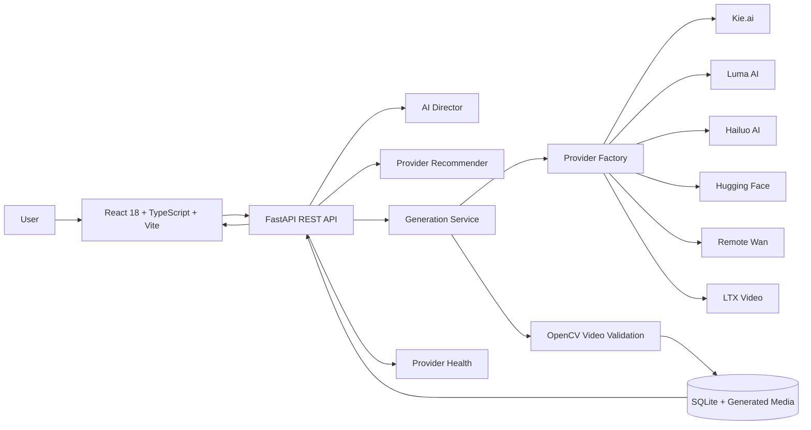

# 🎬 Moviq

> **Production-ready AI Video Generation Platform** built with **React**, **FastAPI**, **TypeScript**, **Python**, and **OpenCV**.

Moviq is an open-source AI video generation platform that unifies multiple commercial and open-source video generation providers behind a single, provider-independent architecture. It combines AI-powered prompt enhancement, intelligent provider routing, computer vision validation, and execution observability into one modern developer experience.

<p align="center">


</p>

---

# 🎥 Live Demo

<p align="center">

<a href="YOUR_GITHUB_RELEASE_LINK">

</a>

</p>

<p align="center">

<a href="YOUR_GITHUB_RELEASE_LINK">

</a>

<a href="./docs/DEVELOPER_QUICKSTART.md">

</a>

<a href="./docs/API_DOCUMENTATION.md">

</a>

</p>

> **Note**
>
> The full demonstration video is available in the GitHub Release assets. The preview above is a short GIF showing the application workflow.

---

# 📌 Overview

Moviq is a modular AI Video Generation Platform designed around a provider-independent backend architecture. Instead of integrating with a single model, Moviq provides a unified interface for multiple AI video providers through a standardized execution pipeline.

The platform currently supports commercial services such as **Kie.ai**, **Luma AI**, and **Hailuo AI**, alongside open-source diffusion models including **Hugging Face Wan**, **Remote Wan**, and **LTX Video**. Every provider follows the same lifecycle for authentication, job submission, polling, download, validation, and media delivery.

Beyond video generation, Moviq includes an **AI Director** for prompt enhancement, **provider health telemetry**, **semantic provider recommendation**, **execution timeline observability**, and **OpenCV-based motion validation** to ensure generated outputs are valid videos before they are streamed or downloaded.

### Highlights

- 🎥 Multi-provider AI video generation platform
- 🧠 AI Director for prompt enhancement
- 🔀 Provider-independent Factory & Strategy architecture
- 📡 Live provider health monitoring
- ⏱️ Execution timeline & observability
- 🛡️ OpenCV motion validation for generated videos
- 📂 Generation history, favorites, and downloads
- ⚡ FastAPI REST backend with React 18 frontend
- 🧪 Automated backend testing (87/87 passing)
- 📖 Comprehensive developer documentation

> **Important**
>
> Some providers require their own API keys, active subscriptions, or usage credits. Video quality, generation speed, and feature availability depend on the selected provider.
> # ✨ Key Features

## 🤖 AI Generation

- **Multi-Provider Video Generation** – Generate videos using multiple AI providers through a unified interface.
- **AI Director Prompt Enhancement** – Automatically restructures prompts into cinematic instructions using subject, environment, action, camera, lighting, and mood.
- **Provider Recommendation Engine** – Suggests the most suitable provider based on prompt semantics.
- **Transparent Smart Failover** – Optionally retries compatible providers when enabled, with every failover recorded in the execution timeline.

---

## 🏗️ Platform Architecture

- **Provider-Independent Design** – Factory and Strategy patterns allow providers to be added or replaced without affecting the application.
- **Unified Provider Lifecycle** – Authentication, submission, polling, download, validation, and cleanup follow a standardized workflow.
- **RESTful FastAPI Backend** – Typed APIs with Pydantic validation, SQLAlchemy ORM, and structured error handling.
- **Modern React Frontend** – Built with React 18, TypeScript, and Vite for a responsive developer experience.

---

## 📊 Observability

- **Provider Health Dashboard** – Monitor provider availability, latency, queue status, and authentication state.
- **Generation Timeline** – View every execution stage from prompt submission to completed video.
- **Structured Event Logging** – Execution metadata is persisted for debugging and post-generation analysis.

---

## 🎥 Video Pipeline

- **OpenCV Motion Validation** – Detects and rejects static-image videos using frame-difference analysis.
- **Automatic Thumbnail Extraction** – Generates preview thumbnails from completed videos.
- **Verified MP4 Delivery** – Streams standards-compliant H.264 MP4 files with secure download endpoints.
- **Generation History** – Search, filter, favorite, and manage previously generated videos.

---

## 🧪 Reliability

- **87 Automated Tests** – Backend unit, integration, and stress tests covering provider routing, validation, and API behavior.
- **Robust Error Handling** – Consistent provider exception mapping and descriptive API responses.
- **Secure by Design** – API keys remain server-side with protections against path traversal and SSRF attacks.

---# 🏗️ Architecture

Moviq follows a modular, provider-independent architecture that separates the frontend, backend services, provider integrations, and media validation pipeline. New providers can be added by implementing the common `BaseVideoProvider` interface without changing the core generation workflow.



## Generation Workflow

1. User submits a text prompt.
2. AI Director enhances the prompt (optional).
3. Provider Recommendation Engine selects the most suitable provider.
4. Generation Service submits the request.
5. Provider Factory routes the request to the selected provider.
6. Provider returns generation status.
7. Generated video is downloaded.
8. OpenCV validates motion and extracts a thumbnail.
9. Metadata and timeline events are stored.
10. The completed video becomes available for preview and download.

---

## Core Components

| Component | Responsibility |
|-----------|----------------|
| **React Frontend** | User interface, generation controls, history, timeline, downloads |
| **FastAPI Backend** | REST API, orchestration, validation, persistence |
| **AI Director** | Prompt enhancement and optimization |
| **Provider Factory** | Routes requests to the selected AI provider |
| **Generation Service** | Controls generation lifecycle and provider communication |
| **Video Validator** | Motion validation, thumbnail extraction, MP4 verification |
| **SQLite Database** | Stores generations, events, favorites, metadata |
| **Provider Health** | Live health telemetry and provider status monitoring |

---# 📊 Supported Providers

Moviq provides a unified interface for multiple commercial and open-source AI video generation providers. Each provider is integrated through the common `BaseVideoProvider` abstraction, enabling consistent request handling, status polling, validation, and media delivery.

| Provider | Model | Type | Typical Use Case |
|-----------|-------|------|------------------|
| **Kie.ai** | `kling-3.0/video` | Hosted API | Cinematic, action, automotive, realistic motion |
| **Kie.ai** | `veo-3.1` | Hosted API | High-quality photorealistic video generation |
| **Kie.ai** | `wan-2.1/video` | Hosted API | General-purpose text-to-video |
| **Luma AI** | `dream-machine` | Hosted API | Cinematic storytelling and natural scenes |
| **Hailuo AI** | `hailuo-01` | Hosted API | Character animation and anime-style motion |
| **Hugging Face** | `Wan-AI/Wan2.2-TI2V-5B` | Serverless | Open-source inference and experimentation |
| **Remote Wan** | `Wan-AI/Wan2.1-T2V-1.3B` | Self Hosted | Private GPU deployments |
| **LTX Video** | `ltx-video` | Local GPU | Offline generation and local development |

---

## Provider Capabilities

| Feature | Kie | Luma | Hailuo | Hugging Face | Remote Wan | LTX |
|---------|:---:|:-----:|:------:|:------------:|:----------:|:---:|
| Text-to-Video | ✅ | ✅ | ✅ | ✅ | ✅ | ✅ |
| Image-to-Video* | Depends on selected model | Provider dependent | Provider dependent | Model dependent | Model dependent | Local implementation |
| Provider Health Monitoring | ✅ | ✅ | ✅ | ✅ | ✅ | ✅ |
| Timeline Events | ✅ | ✅ | ✅ | ✅ | ✅ | ✅ |
| MP4 Validation | ✅ | ✅ | ✅ | ✅ | ✅ | ✅ |
| Thumbnail Extraction | ✅ | ✅ | ✅ | ✅ | ✅ | ✅ |
| Smart Recommendation | ✅ | ✅ | ✅ | ✅ | ✅ | ✅ |

> **Note**
>
> Available models, resolutions, durations, and pricing depend on each provider's API and account limits. Moviq exposes provider capabilities but does not override provider-specific restrictions.

---# 🖼️ Application Preview

Explore the primary workflows and interface of Moviq.

---

## 🎬 Create Studio

<p align="center">

</p>

Compose prompts, choose providers, configure generation settings, and enhance prompts using the AI Director.

---

## 🎥 Video Preview

<p align="center">

</p>

Preview generated videos, inspect metadata, monitor progress, and download verified MP4 files.

---

## 📡 Provider Operations

<p align="center">

</p>

Monitor provider availability, authentication status, queue conditions, latency, benchmarks, and health telemetry.

---

## ⏱️ Generation Timeline

<p align="center">

</p>

Inspect every execution stage, including prompt enhancement, provider submission, polling, download, validation, and completion.

---

## 📚 Recent History

<p align="center">

</p>

Browse previous generations with search, filters, favorites, thumbnails, timeline inspection, and verified MP4 downloads.

---# 🚀 Quick Start

## Prerequisites

- Python **3.11+**
- Node.js **18+**
- npm
- Git

---

## 1. Clone Repository

```bash
git clone https://github.com/rzvn6660/Moviq.git
cd Moviq
```

---

## 2. Backend Setup

```bash
cd backend

python -m venv venv

# Windows
venv\Scripts\activate

# Linux / macOS
source venv/bin/activate

pip install -r requirements.txt

cp .env.example .env
```

Start the backend:

```bash
uvicorn app.main:app --reload --port 8001
```

---

## 3. Frontend Setup

```bash
cd ..

npm install

npm run dev
```

Open:

```
http://localhost:5173
```

---

## 4. Generate Your First Video

1. Enter a prompt.
2. Select an AI provider.
3. (Optional) Enable AI Director.
4. Click **Generate**.
5. Monitor the timeline.
6. Preview and download the generated MP4.

---
