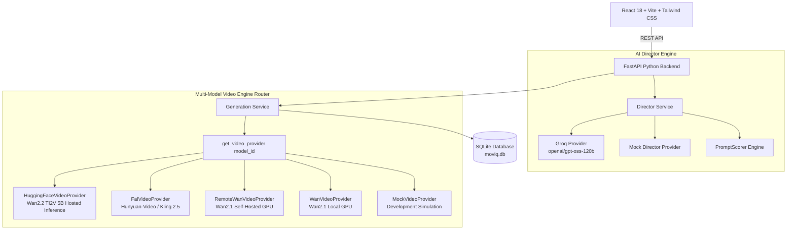

# Moviq — Turn Ideas Into Motion

> AI-Powered Video Creation Studio transforming simple user ideas into professionally directed motion clips.

---

## 📌 Overview

**Moviq** is a full-stack AI video creation studio designed to turn simple text prompts into high-fidelity AI videos. It pairs a **Groq-powered AI Director (`openai/gpt-oss-120b`)** for cinematic parameter expansion with a **Multi-Model / Multi-Provider Video Generation Architecture** supporting:
- **Hosted Inference**: Hugging Face Inference API (`Wan-AI/Wan2.2-TI2V-5B` via `fal-ai` serverless router)
- **Hosted API / Cloud Queue**: `fal-ai` open video models (`fal-ai/kling-video/v2.5-turbo/pro/text-to-video`, `hunyuan-video-v1`)
- **Self-Hosted GPU**: Open-source CUDA GPU workers (`Wan-AI/Wan2.1-T2V-1.3B-Diffusers` via Kaggle/remote worker API)
- **External Web Models**: Unconfigured / external models (`Pika 2.5`, `Dream Machine v2.5`, `Gen-3 Alpha`) with clean availability badges & external provider links
- **Simulation / Demo**: Offline development simulation (`MockVideoProvider`)

---

## 🎬 Demo Workflow

```
Idea Input ──► AI Director ──► Enhanced Prompt & 6-Axis Parameters ──► Multi-Model Selector ──► Dynamic Provider Router ──► Playback & Export
```

1. **Idea Input**: User enters a simple concept (e.g. *"A futuristic sports car driving through a rain-soaked city at night"*).
2. **AI Director Enhancement**: Groq expands the idea into an enhanced prompt and 6-axis camera direction parameters (`subject`, `environment`, `action`, `camera`, `lighting`, `mood`), providing a before/after prompt score.
3. **Interactive Control**: User retains full control to inspect, edit, or customize the enhanced prompt and negative parameters.
4. **Multi-Model Engine Selection**: User selects a model engine in `AdvancedSettings`. Moviq displays execution modes (`HOSTED_INFERENCE`, `SELF_HOSTED`, `EXTERNAL_WEB`), status badges (`READY`, `NOT CONFIGURED`), and direct external links for unconfigured models.
5. **Generation & Lifecycle**: Generation request is routed to the exact provider matching `model_id` with a unique `Idempotency-Key` header, advancing through async lifecycle stages (`QUEUED` → `SUBMITTED` → `GENERATING` → `PROCESSING` → `COMPLETED`).
6. **Playback & Export**: Rendered video streams in the custom VideoPreview player with one-click download, variation creation, generation inspector, and persistent history.

---

## ⭐ Core Features

- **Groq AI Director (`openai/gpt-oss-120b`)**: Structured output generation for camera framing, lighting ratio, and cinematic mood mapping.
- **Multi-Model / Multi-Provider Dynamic Routing**: Model selection dynamically resolves the matching backend execution path (`HuggingFaceVideoProvider`, `FalVideoProvider`, `RemoteWanVideoProvider`, `WanVideoProvider`).
- **Execution Mode & Availability Enforcement**: Unconfigured or external models are cleanly marked `NOT CONFIGURED` with explicit backend error rejection instead of secret fallback to mock demo assets.
- **Persistent Execution Mode Metadata**: `execution_mode` is stored on database records and rendered in the `GenerationInspector`.
- **Deterministic PromptScorer**: 100-point scoring engine quantifying prompt enhancement quality.
- **Wan2.1 T2V 1.3B Open-Source Provider**: Locally executable PyTorch & Diffusers GPU diffusion pipeline and remote worker integration.
- **Backend-Enforced Idempotency**: Database-level deduplication via `Idempotency-Key` headers.
- **Truthful Asynchronous Progress**: Supports both percentage-based and stage-based progress indicators.
- **Generation Inspector**: Technical metadata viewer displaying AI Engine, Provider, Execution Mode, Resolution, FPS, and Prompt Lineage.

---

## 📐 System Architecture



---

## 🔌 API Reference Summary

| Endpoint | Method | Description |
| :--- | :--- | :--- |
| `/api/v1/health` | `GET` | Service health status and version info |
| `/api/v1/models` | `GET` | List available model capabilities, execution modes, and configuration status |
| `/api/v1/director/enhance` | `POST` | Expand prompt into structured 6-axis direction |
| `/api/v1/generations` | `POST` | Submit video generation job (supports `Idempotency-Key` and `model_id` routing) |
| `/api/v1/generations/{id}` | `GET` | Poll generation status, progress, or output |
| `/api/v1/generations/{id}/video` | `GET` | Serve locally stored MP4 video file |
| `/api/v1/generations/{id}/download` | `GET` | Secure streaming proxy download with `Content-Disposition` |
| `/api/v1/generations` | `GET` | List recent generation history |

---

## 🧪 Testing & Quality Assurance

Run the comprehensive backend test suite:
```bash
cd backend
venv\Scripts\python -m pytest
```
**Test Results**: `66 passed out of 66 tests` (100% pass rate in 15.26s).

Run frontend production build verification:
```bash
npm run build
```
**Build Result**: `Succeeded` with 0 TypeScript or Vite errors.
