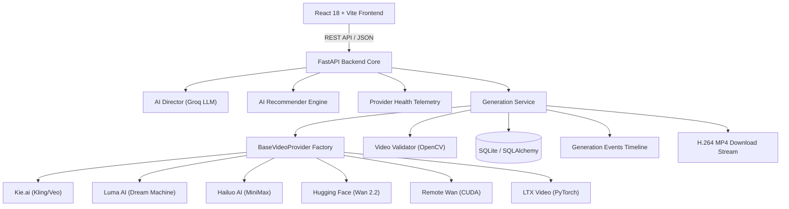

# 🎬 Moviq — Modular AI Video Generation Studio

> A high-performance open-source AI video generation studio and provider-orchestration platform built with React 18, FastAPI, PyTorch, and OpenCV.


---

## 📌 Overview

**Moviq** is an open-source AI video generation studio designed with a provider-independent architecture. It abstracts commercial cloud AI engines and self-hosted open-source diffusion models behind a unified backend service layer.

Users can compose text prompts, enhance cinematic camera keyframes using an **AI Director LLM**, evaluate real-time provider health, execute video generations across 6 AI provider backplanes, inspect microsecond generation event timelines, and stream or download verified H.264 MP4 containers.

---

## ✨ Features

- **🧠 Multi-Provider Architecture**: Unified routing across Kie.ai (Kling 3.0 Pro, Wan 2.1, Google Veo 3.1), Luma AI (Dream Machine), Hailuo AI (MiniMax Video 01), Hugging Face (Wan 2.2), Remote Wan (Self-Hosted CUDA), and LTX Video (Local PyTorch GPU).
- **🎬 AI Director Prompt Enhancer**: Structural prompt engineering (Subject, Environment, Action, Camera, Lighting, Mood) powered by Groq LLM with offline fallback.
- **📡 Provider Health Telemetry**: Live monitoring of ping latency, queue traffic, credential verification, and model availability with an async 45-second TTL cache lock.
- **🎯 Semantic Recommendation Engine**: Rule-based keyword matching recommending optimal video models based on visual themes (cars → Kling, nature → Luma, anime → Hailuo).
- **🔀 Optional Smart Failover**: Automatic fallback provider sequence with microsecond audit event timeline logging. Zero silent substitutions.
- **📊 Truthful Cost & Benchmark Metrics**: Measured runtime, queue delay, success rate, and documented credit requirements. Zero fabricated numbers.
- **👁️ Computer Vision Video Validation (v2)**: OpenCV frame-difference motion analysis (`absdiff`) that automatically detects and rejects static images disguised as MP4s.
- **⚡ Microsecond Observability Timeline**: 13-stage execution audit trail tracking every step from prompt submission to thumbnail extraction.

---

## 🏗️ System Architecture



---

## 📊 Provider Matrix

| Provider | Model ID | Execution Mode | Supported Aspect Ratios | Max Duration | Negative Prompt |
| :--- | :--- | :--- | :--- | :--- | :--- |
| **Kie.ai** | `kling-3.0/video` | Hosted API | `16:9`, `9:16`, `1:1` | 10s | Yes |
| **Kie.ai** | `wan-2.1/video` | Hosted API | `16:9`, `1:1` | 5s | Yes |
| **Kie.ai** | `veo-3.1` | Hosted API | `16:9`, `9:16`, `1:1` | 10s | No |
| **Luma AI** | `dream-machine` | Hosted API | `16:9`, `9:16`, `1:1` | 5s | No |
| **Hailuo AI** | `hailuo-01` | Hosted API | `16:9`, `9:16`, `1:1` | 5s | Yes |
| **Hugging Face** | `Wan-AI/Wan2.2-TI2V-5B` | Serverless Inference | `16:9` | 5s | Yes |
| **Remote Wan** | `Wan-AI/Wan2.1-T2V-1.3B-Diffusers` | Self-Hosted CUDA | `16:9` | 5s | Yes |
| **LTX Video** | `ltx-video` | Local PyTorch GPU | `16:9` | 5s | Yes |

---

## 🚀 Quickstart Guide

### Prerequisites
- Python 3.11 or 3.13
- Node.js 18+

### 1. Backend Setup
```bash
cd backend

# Create virtual environment
python -m venv venv
source venv/bin/activate  # Windows: venv\Scripts\activate

# Install dependencies
pip install -r requirements.txt

# Configure environment variables
cp .env.example .env

# Run FastAPI server
uvicorn app.main:app --port 8001 --reload
```

### 2. Frontend Setup
```bash
# In repository root
npm install
npm run dev
```
Open `http://localhost:5173` in your browser.

---

## 🔒 Security & Protection

- **Credential Protection**: API keys (`KIE_API_KEY`, `HF_TOKEN`, `LUMA_API_KEY`, `HAILUO_API_KEY`) remain strictly backend-only. Never exposed in responses or client JS bundles.
- **SSRF Mitigation**: Remote video download endpoints validate domain destinations against loopback (`127.0.0.1`, `localhost`) and private subnet boundaries.
- **Path Traversal Protection**: Local file serving strictly enforces `filepath.startswith(generated_dir)` path boundaries.
- **Idempotency**: Supports `Idempotency-Key` headers to prevent race conditions or duplicate generation jobs.

---

## 📚 Documentation Links

- [Architecture Guide](docs/ARCHITECTURE.md)
- [Provider Matrix](docs/PROVIDER_MATRIX.md)
- [REST API Documentation](docs/API_DOCUMENTATION.md)
- [Developer Quickstart](docs/DEVELOPER_QUICKSTART.md)
- [Troubleshooting Guide](docs/TROUBLESHOOTING.md)
- [FAQ](docs/FAQ.md)

---

## 📄 License

Distributed under the MIT License. See [LICENSE](LICENSE) for details.
